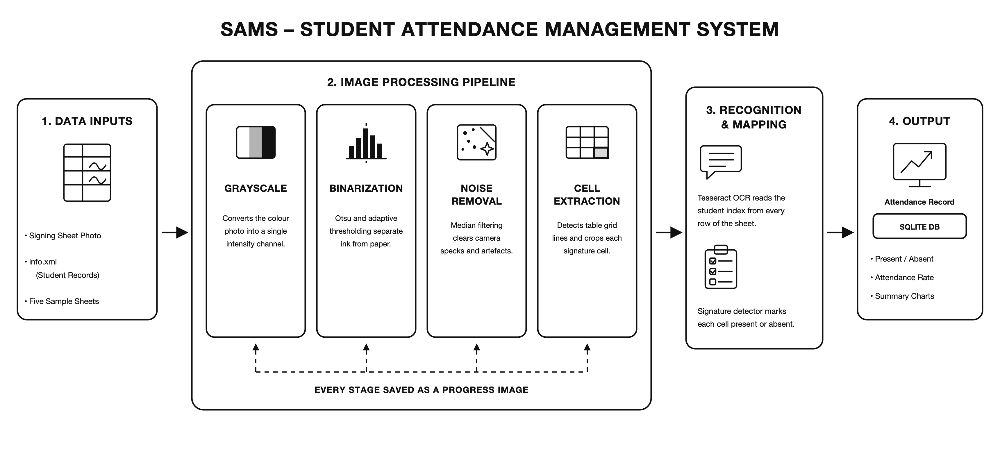

# Student Attendance Management System (SAMS)

An image-processing based attendance system that reads scanned or photographed
signing sheets, detects which students have signed, and stores the results in a
local database for visualization.

- **Module:** CS402.3 — Computer Graphics and Visualization
- **Module Leader:** Dr. Rasika Ranaweera

---

## Overview

Admin staff photograph a printed signing sheet with their smartphones and supply
the image together with an XML file of student records. SAMS processes the image
through a computer-vision pipeline, decides whether each student's signature cell
is filled, and records the attendance.



*Figure 1 — End-to-end flow from signing sheet photograph to stored attendance record.*

---

## Team Members

| # | Member | Role | Branch |
|---|--------|------|--------|
| 1 | Ramudi Wijethunga | Project Lead & System Architect | `feature/system-architecture` |
| 2 | Tharusha Rasath | Image Preprocessing Pipeline | `feature/image-preprocessing` |
| 3 | DMT Dissanayake | OCR & Text Extraction | `feature/ocr-extraction` |
| 4 | Heshan Silva | Signature Detection | `feature/signature-detection` |
| 5 | Ashan Madusanka | Attendance Processing Logic | `feature/attendance` |
| 6 | Senira Sachinthaka | Database Management | `feature/database-management` |
| 7 | Pabasara Ashen | Data Visualization (`infovis.py`) | `feature/visualization` |
| 8 | Ashini Nimna | Advanced Signature Recognition | `feature/signature-investigation` |
| 9 | Disal Jayanaka | Testing & Quality Assurance | `feature/testing` |
| 10 | Naveen Kavindu | Documentation & Report | `feature/documentation` |

---

## Technology Stack

| Area | Technology |
|------|------------|
| Language | Python 3.8+ |
| Image processing | OpenCV 4.8, NumPy 1.24 |
| OCR | Tesseract 5.0 via pytesseract 0.3.10 |
| Data handling | pandas 2.0 |
| Database | SQLite3 (standard library) |
| Visualization | Matplotlib 3.7, Seaborn 0.12 |
| Image comparison | scikit-image 0.21 |
| Testing | pytest 7.4, pytest-cov 4.1 |

---

## Installation

### 1. Prerequisites

Python 3.8 or newer, plus the Tesseract OCR engine installed on the system.

**macOS**

```bash
brew install tesseract
```

**Windows**

Download the installer from
[UB Mannheim](https://github.com/UB-Mannheim/tesseract/wiki) and add the install
directory (usually `C:\Program Files\Tesseract-OCR`) to your `PATH`.

**Linux (Debian/Ubuntu)**

```bash
sudo apt install tesseract-ocr
```

### 2. Clone and set up the project

```bash
git clone https://github.com/Ramudii/attendance-management-system.git
cd attendance-management-system

python -m venv venv
source venv/bin/activate        # Windows: venv\Scripts\activate

pip install -r requirements.txt
```

### 3. Verify the environment

```python
python setup_verify.py
```

This checks the Python version, confirms every dependency imports correctly and
reports whether Tesseract is reachable.

---

## Usage

### Process a signing sheet

```bash
python sams.py data/sample_images/1.jpeg data/info.xml
```

Add `--verbose` to print each image-processing stage as it runs, and `--output`
to write the result as JSON:

```bash
python sams.py data/sample_images/1.jpeg data/info.xml --verbose --output report.json
```

### Process all sheets at once

```bash
python sams.py --batch data/sample_images/ data/info.xml --output batch_results.json
```

### Visualize a student's attendance

```bash
python infovis.py 001
```

### Investigate a signature for authenticity

```bash
python investigate.py 001
```

Intermediate images from every processing stage are written to
`reports/progress_images/`, and a combined contact sheet is saved as
`reports/progress_grid.png`.

---

## Project Structure

```
attendance-management-system/
├── sams.py                     # Main entry point — attendance processing
├── setup_verify.py             # Environment and dependency checker
├── requirements.txt
├── data/
│   ├── info.xml                # Student records supplied by admin staff
│   └── sample_images/          # Five signing sheets (1–5.jpeg)
├── reports/                    # Generated progress images and charts
├── src/
│   ├── logger.py               # Shared logging configuration
│   ├── image_processing/
│   │   ├── image_processor.py  # Grayscale, threshold, denoise, cell extraction
│   │   └── generate_report_images.py
│   ├── ocr/
│   │   ├── ocr_extractor.py    # Tesseract wrapper for cell text
│   │   ├── xml_parser.py       # info.xml reader
│   │   └── data_cleaner.py     # Normalises extracted indices and names
│   ├── detection/
│   │   └── signature_detector.py
│   ├── attendance/
│   │   ├── attendance_manager.py
│   │   ├── attendance_processor.py
│   │   └── report_generator.py
│   ├── database/
│   │   └── database_manager.py
│   └── visualization/
└── tests/
    ├── test_preprocessing.py
    └── test_ocr.py
```

---

## Processing Pipeline

| Stage | Operation | Module |
|-------|-----------|--------|
| 1 | Load image and validate | `ImageProcessor.load_image` |
| 2 | Convert to grayscale | `ImageProcessor.convert_to_grayscale` |
| 3 | Binarize (Otsu / adaptive) | `ImageProcessor.apply_thresholding` |
| 4 | Remove noise (median / Gaussian) | `ImageProcessor.remove_noise` |
| 5 | Detect edges (Canny) | `ImageProcessor.detect_edges` |
| 6 | Extract signature cells from the table grid | `ImageProcessor.extract_signature_cells` |
| 7 | Read index and name text | `OCRExtractor.extract_text_from_cell` |
| 8 | Decide present / absent per cell | `SignatureDetector` |
| 9 | Map results to student records | `AttendanceProcessor` |
| 10 | Persist to SQLite | `DatabaseManager` |

---

## Input Format

`info.xml` holds the student roster for a session:

```xml
<attendance_info>
    <header>
        <module>CS402.3 - Computer Graphics and Visualization</module>
        <lecturer>Dr. Rasika Ranaweera</lecturer>
        <date>2026-08-06</date>
    </header>
    <students>
        <student>
            <index>001</index>
            <name>John Snow</name>
            <title>Mr</title>
        </student>
    </students>
</attendance_info>
```

---

## Testing

```bash
pytest                              # run the full suite
pytest --cov=src --cov-report=html  # with a coverage report
pytest tests/test_preprocessing.py  # a single module
```

---

