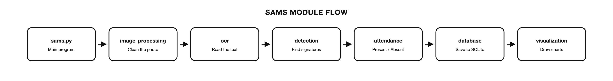

# System Architecture

- **Module:** CS402.3 — Computer Graphics and Visualization
- **System:** Student Attendance Management System (SAMS)

---

## Overview

SAMS takes a photo of a signing sheet and an XML file of student records, works
out who signed, and saves the result to a database.

*Figure 1 — End-to-end flow from signing sheet photograph to stored attendance record.*

---

## Module Map

*Figure 2 — The order data passes through the modules.*

| Folder | Class | What it does |
|--------|-------|--------------|
| `src/image_processing` | `ImageProcessor` | Cleans the photo and cuts out the signature cells |
| `src/ocr` | `OCRExtractor` | Reads the student index text and loads `info.xml` |
| `src/detection` | `SignatureDetector` | Decides if a cell has a signature |
| `src/attendance` | `AttendanceManager` | Marks each student Present or Absent |
| `src/database` | `DatabaseManager` | Saves the results to SQLite |
| `src/visualization` | `infovis.py` | Draws the attendance charts |

---

## Data Flow

1. **Load** the sheet photo
2. **Grayscale** — remove colour, keep brightness only
3. **Denoise** — median filter clears camera specks
4. **Binarize** — adaptive threshold separates ink from paper
5. **Find edges** — Canny locates the table lines
6. **Cut cells** — crop one signature box per student row
7. **Read text** — Tesseract reads the student index
8. **Detect signature** — mark each cell present or absent
9. **Map students** — match the results to the `info.xml` list
10. **Save** — write the records to SQLite

Every step saves an image to `reports/progress_images/`, and all of them are
combined into `reports/progress_grid.png`.

---

