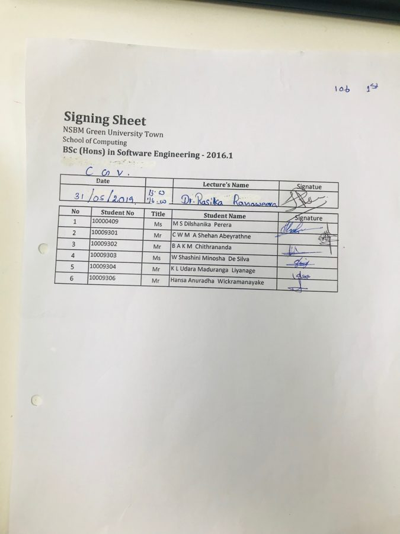
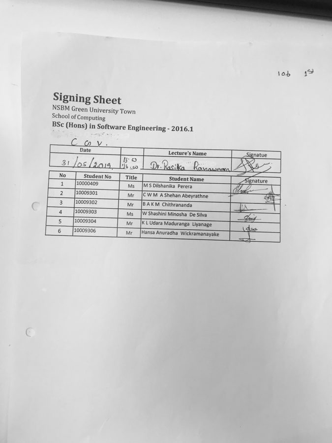
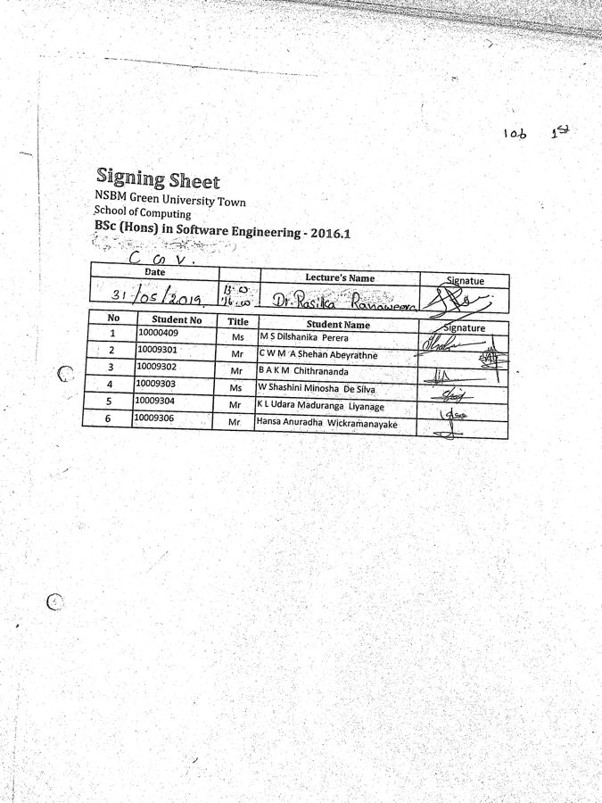
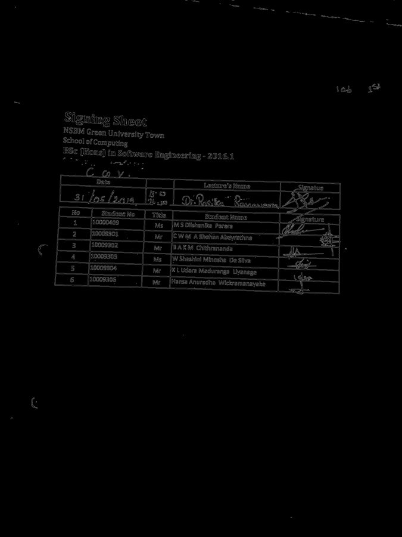
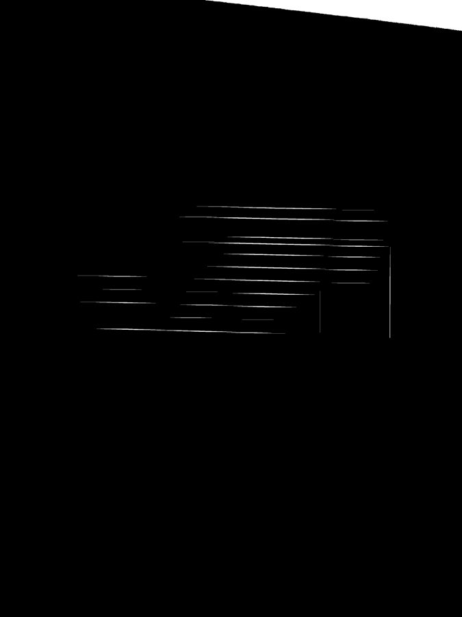
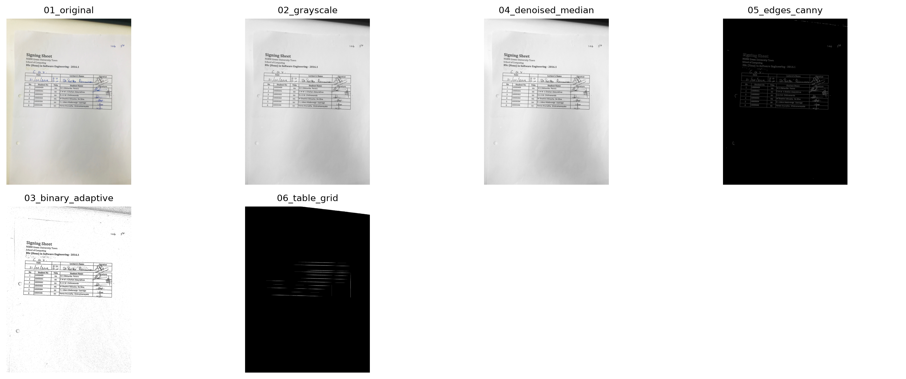

# Image Processing Steps

- **Module:** CS402.3 — Computer Graphics and Visualization
- **Input used:** `data/sample_images/1.jpeg` (3024 × 4032 pixels)

This document shows each step the program performs on a signing sheet photo.
All images below were produced by `ImageProcessor` in
`src/image_processing/image_processor.py`.

---

## Step 1 — Load the Image

The photo is read from disk and checked. Unsupported formats and corrupt files
are rejected before any processing starts.

**OpenCV function:** `cv2.imread()`



---

## Step 2 — Grayscale

Colour is removed so only brightness remains. Students sign with different
coloured pens, so colour carries no useful information — dropping it turns three
channels into one and makes every later step faster.

**OpenCV function:** `cv2.cvtColor(image, cv2.COLOR_BGR2GRAY)`



---

## Step 3 — Noise Removal

A median filter replaces each pixel with the middle value of its neighbours.
This clears the specks and grain that phone cameras produce, without blurring
the pen strokes.

**OpenCV function:** `cv2.medianBlur(image, 3)`


---

## Step 4 — Binarization

Every pixel becomes either black or white. Adaptive thresholding calculates a
different threshold for each small region, so shadows on one side of the page do
not wipe out the writing there.

**OpenCV function:** `cv2.adaptiveThreshold()` with a Gaussian neighbourhood



---

## Step 5 — Edge Detection

Canny finds the sharp brightness changes in the image. These are mostly the
printed table lines, which is what we need to locate the signature column.

**OpenCV function:** `cv2.Canny(image, 50, 150)`



---

## Step 6 — Table Grid and Cell Extraction

Long horizontal and vertical lines are isolated separately using morphological
opening. Where the lines are dense gives the row and column positions of the
table. The signature column is the last column, and one cell is cropped per
student row.

**OpenCV functions:** `cv2.morphologyEx()` with `cv2.MORPH_OPEN`



---

## All Steps Together

`create_progress_grid()` combines every step into one labelled figure:



---

## Results on the Five Sample Sheets

| Sheet | Size | Signature cells found |
|-------|------|----------------------|
| `1.jpeg` | 3024 × 4032 | 5 |
| `2.jpeg` | 3024 × 4032 | 71 |
| `3.jpeg` | 3024 × 4032 | 4 |
| `4.jpeg` | 3024 × 4032 | 5 |
| `5.jpeg` | 3024 × 4032 | 3 |

Each sheet holds 6 students, so the counts are not yet correct. Sheet 2 detects
71 cells because the photo is skewed and the line-finding step treats one thick
line as many. This is the main issue still to fix.

---

## How to Reproduce

```bash
python -m src.image_processing.image_processor data/sample_images/1.jpeg
```

Individual step images are written to `reports/progress_images/`, and the
combined figure to `reports/progress_grid.png`.
